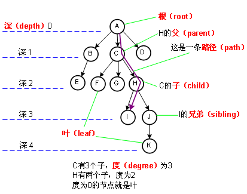

# 树(Tree)
> - 树是一种“一对多”的数据结构，是`n(n≥0)`个结点的有限集，其中`n=0`时称为空树
> - 一棵树由称作根(`root`)的结点r以及0个或多个非空的(子)树T1,T2,T3......组成，这些子树中每一颗的根都来自根r的一条有向边(`Edge`)所连接。
> -

- `n>0`时，根结点唯一
- `n>1`时，除去根结点的其他结点构成若干个互不相交的有限集`T1,T2...`，其中每一个集合又是一棵树，称为根的`子树`
- 结点拥有的子树数称为结点的`度`(`Degree`)，度为0的结点称为`叶子结点`
- 树的度是树内各结点的度的最大值
- 结点的层数是从根开始定义起，根为第一层，根的孩子是第二层，以此类推。树中结点的最大层次称为树的`深度`(`Depth`)或高度
- 如果各子树看成从左至右不可互换的，则称为`有序树`，否则为`无序树`
- `森林`是互不相交的树的集合，某个结点的子树可以看做是森林

- `树叶`（`leaf`）：没有儿子的节点。
- `兄弟`（`siblings`）：具有相同父亲的节点。用类似的方法可以定义`祖父`（`grandparent`）和`孙子`（`grandchild`）关系。
- 节点n的`深度`（`depth`）：从根节点到节点n的唯一路径的长。
- 节点n的`高度`（`height`）：从n到一片树叶的最长路径的长。
- `祖先`（`ancestor`）：如果存在从n1到n2的一条路径，那么n1是n2的一位祖先。而n2是n1的一个`后裔`（`descendant`）。
- `真祖先`（`proper ancestor`）：先满足是祖先，如果n1不等于n2，那么n1是n2的真祖先，而n2是n1的`真后裔`（`proper ancestor`）。

## `二叉树`
> - 二叉树的每个结点至多只有二棵子树(不存在度大于2的结点)，二叉树的子树有左右之分，次序不能颠倒。二叉树的第i层至多有2i-1个结点；深度为k的二叉树至多有2k-1个结点；对任何一棵二叉树T，如果其终端结点数为n0，度为2的结点数为n2，则n0=n2+1。
> - 

- 在非空二叉树中，第i层的结点总数不超过2i-1, i>=1;
- 深度为h的二叉树最多有2h-1个结点(h>=1)，最少有h个结点;
- 对于任意一棵二叉树，如果其叶结点数为N0，而度数为2的结点总数为N2，则N0=N2+1;
- 具有n个结点的完全二叉树的深度为log2(n+1);
- 有N个结点的完全二叉树各结点如果用顺序方式存储，则结点之间有如下关系：
   - 若I为结点编号则 如果I>1，则其父结点的编号为I/2；
   - 如果2I<=N，则其左儿子（即左子树的根结点）的编号为2I；若2I>N，则无左儿子；
　 - 如果2I+1<=N，则其右儿子的结点编号为2I+1；若2I+1>N，则无右儿子。
- 给定N个节点，能构成h(N)种不同的二叉树，其中h(N)为卡特兰数的第N项，h(n)=C(2*n, n)/(n+1)。
- 设有i个枝点，I为所有枝点的道路长度总和，J为叶的道路长度总和J=I+2i。

### 满二叉树
> - 除最后一层无任何子节点外，每一层上的所有结点都有两个子结点。也可以这样理解，除叶子结点外的所有结点均有两个子结点。节点数达到最大值，所有叶子结点必须在同一层上。
- 一颗树深度为h，最大层数为k，深度与最大层数相同，k=h;
- 叶子数为2h;
- 第k层的结点数是：2k-1;
- 总结点数是：2k-1，且总节点数一定是奇数。 

### 完全二叉树
> - 若设二叉树的深度为h，除第 h 层外，其它各层 (1～(h-1)层) 的结点数都达到最大个数，第h层所有的结点都连续集中在最左边，这就是完全二叉树。

